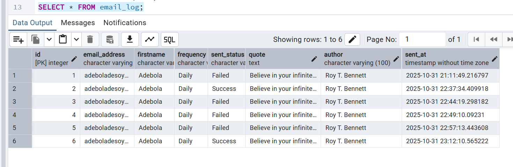

# DEC-Launchpad-ZenQuotes API Python Project

This project tested my data engineering and automation skills in building an automated quote email delivery platform for MindFuel, a mental wellness startup.

The system fetches daily inspirational quotes from the ZenQuotes API, stores them in a database, and automatically sends personalized quotes to subscribed users based on their frequency preferences (daily or weekly).

## Objectives

1. ✅ Pull new quotes daily from [ZenQuotes API](https://zenquotes.io/api/today/)

2. ✅ Personalize and send quotes to subscribed users at 7:00 AM daily

3. ✅ Log all activity, including success/failure details

4. ✅ Scale easily to support hundreds or thousands of users.

## System Architecture
Start
├─ Load environment variables & initialize logging

├─ Fetch daily quote from ZenQuotes API

├─ Save quote to database (zenquote table)

├─ Retrieve active user list with subscription preferences

├─ Send personalized emails to each user

├─ Log email status in email_log 

├─ Send summary report to 

└─ Schedule recurring tasks (daily/weekly)

# Technical Implementation
## API Integration & Data Ingestion

**Script**: [./script.py](script.py)

Python scripts were written to extract daily quotes from the ZenQuotes API and ingest them into a PostgreSQL database implementing 2 retry attempts for connectivity issues with a transaction date, indicating when each quote was fetched. The script uses `psycopg2.extras.execute_values()` for efficient bulk inserts, writing multiple records (quote, author, and transaction date) into the table. This ensures that each daily quote is stored reliably.

## Database Schema
**Tables Created:** [the sql statement](SQLstatement.sql)

1. zenquote table - Stores daily quotes with timestamp

2. users table - Manages subscriber information and preferences

3. email_log table - Tracks all email delivery attempts

## Users table & Email delivery

The sample users table created stores each user’s email address, first name, activity status, and subscription frequency (daily or weekly). See [./SQLstatement.sql](SQLstatement.sql) for the SQL used to create it.

## Key Functions Implemented

| Function                    | Description                                                                                                                                                              |
| --------------------------- | ------------------------------------------------------------------------------------------------------------------------------------------------------------------------ |
| **`get_daily_quote()`**     | Fetches a new quote from ZenQuotes API. Includes 2 retries in case of network failure and logs each attempt.                                                             |
| **`save_quote_to_db()`**    | Inserts the fetched quote and author into the `zenquote` table in the database.                                                                                          |
| **`get_users()`**           | Retrieves active users from the `users` table based on their email frequency preference (daily or weekly). Returns firstname and email for each user.                    |
| **`send_email()`**          | Sends emails using Gmail SMTP. Uses an *App Password* (generated in Gmail under **Manage Account → App Passwords**) for security instead of the main password.           |
| **`log_email_status()`**    | Records both successful and failed email sends into the `email_log` table for traceability and monitoring.                                                               |
| **`send_summary_report()`** | Sends a summary report to the admin email (set in `.env`) detailing how many emails were sent successfully or failed. Missing this report indicates a scheduler failure. |

## Email Configuration Notes

During testing, Gmail’s default SMTP on port 587 (STARTTLS) failed due to timeout or firewall issues.
Switching to SSL (port 465) resolved the problem, and email sending worked correctly.

## Logging & Monitoring

The `script.py` maintains full logs of operations:

Application logs are saved in [quotes_mailer.log](quotes_mailer.log), showing daily activities, retries, and email status.

Database logs are stored in the email_log table, including email address, firstname, frequency, quote, author, send status, and timestamp. This provides complete visibility for monitoring and analytics.

Likewise, daily email stats and summary logs was sent to the admin to note how many successful and failed emails.

A screenshot of email_log data

## Summary of Script Flow

**Start**

├─ Load environment variables and initialize logging

├─ Fetch daily quote from API

├─ Save quote to PostgreSQL table (zenquote)

├─ Retrieve users (daily/weekly subscribers)

├─ Send personalized emails to users

├─ Log all sent statuses to DB (email_log)

├─ Send summary report to admin

└─ Schedule tasks daily/weekly

## Scheduling (Windows Task Scheduler)

The script was automated using Windows Task Scheduler to run daily and weekly at 7:00 AM. Cron job (crontab -e)could not be used as the script was not written in linux environment.

**Setup Steps**

1. Created a New Task: Added task name and description. Ensure it runs even when the computer is asleep or logged out.

2. Specified the Action by selecting _Start a Program_ and browse to the Python executable. Script path added in“Arguments”.

3. The trigger timing and schedule settings created to run daily

4. Saved and run-test to confirm the email delivery and logs
